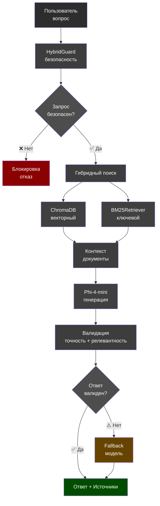

[](https://colab.research.google.com/github/SkyYorker/Rag_system-neuro_lawyer/blob/main/RAG-%D1%81%D0%B8%D1%81%D1%82%D0%B5%D0%BC%D0%B0_%D0%BD%D0%B5%D0%B9%D1%80%D0%BE-%D1%8E%D1%80%D0%B8%D1%81%D1%82.ipynb)
[](https://opensource.org/licenses/MIT)
[](https://www.python.org/downloads/)

# RAG-ассистент нейро-юрист

Интеллектуальный юридический ассистент на базе RAG (Retrieval-Augmented Generation) с защитой от галлюцинаций и фильтрацией запросов. Проект оформлен как портфолио-репозиторий.

## Статус проекта

**Основной компонент:** Jupyter ноутбук с полной RAG-системой

- **Полная RAG-система** реализована в `RAG-система_нейро-юрист.ipynb`
- Гибридный поиск (ChromaDB + BM25)
- HybridGuard - многоуровневая фильтрация
- Детекция галлюцинаций
- Валидация ответов и источников
- Работает в Colab с GPU

## Возможности
- Безопасность: многоуровневая фильтрация (HybridGuard: ключевые слова, regex, модерация LLM)
- Качество: валидация ссылок на статьи законов, проверка релевантности
- Поиск: гибридный (векторный Chroma + BM25)
- Генерация: локальная модель через `transformers` (`microsoft/Phi-4-mini-instruct`)
- Источники: выводит использованные документы
- Трассировка (опционально): Phoenix

## Архитектура системы

```
                    ┌─────────────────┐
                    │   Пользователь  │
                    │   (вопрос)      │
                    └────────┬────────┘
                             │
                             ▼
                    ┌──────────────────┐
                    │  HybridGuard     │
                    │  (безопасность)  │
                    │  • Ключевые      │
                    │    слова         │
                    │  • Regex         │
                    │  • LLM-модерация │
                    └────────┬─────────┘
                             │
                    ┌────────┴────────┐
                    │                 │
                    ▼                 ▼
         ┌─────────────────┐   ┌──────────────┐
         │ ❌ Блокировка   │   │ ✅ Продолжение│
         │     (отказ)     │   └──────┬───────┘
         └─────────────────┘          │
                                      ▼
                         ┌────────────────────┐
                         │  Гибридный поиск   │
                         └────────┬───────────┘
                                  │
                      ┌───────────┴───────────┐
                      │                       │
                      ▼                       ▼
          ┌────────────────────┐  ┌────────────────────┐
          │  ChromaDB          │  │  BM25Retriever     │
          │  векторный поиск   │  │  ключевой поиск    │
          └──────────┬─────────┘  └──────────┬─────────┘
                     │                       │
                     └───────────┬───────────┘
                                 ▼
                    ┌──────────────────────┐
                    │  Контекст документы  │
                    └──────────┬───────────┘
                               │
                               ▼
                    ┌──────────────────────┐
                    │  Phi-4-mini          │
                    │  (генерация ответа)  │
                    └──────────┬───────────┘
                               │
                               ▼
                    ┌──────────────────────┐
                    │  Валидация           │
                    │  • Точность статей   │
                    │  • Релевантность     │
                    └──────────┬───────────┘
                               │
                    ┌──────────┴──────────┐
                    │                     │
                    ▼                     ▼
         ┌──────────────────┐   ┌──────────────────┐
         │ ⚠️ Fallback      │   │ ✅ Ответ валиден │
         │    модель        │   │                  │
         └────────┬─────────┘   └────────┬─────────┘
                  │                      │
                  └──────────┬───────────┘
                             ▼
                    ┌──────────────────┐
                    │  Ответ +         │
                    │  Источники       │
                    └──────────────────┘
```

<details>
<summary> Интерактивная диаграмма (Mermaid)</summary>



</details>

**Компоненты:**
- **HybridGuard**: Многоуровневая фильтрация запросов (ключевые слова → regex → LLM)
- **Гибридный поиск**: Комбинация векторного (ChromaDB) и ключевого (BM25) поиска
- **Генерация**: Локальная модель Phi-4-mini через transformers
- **Валидация**: Проверка точности ссылок на статьи и релевантности ответов

## Запуск в Colab
Откройте блокнот в Colab по бейджу выше. Выполните ячейки по порядку; для работы с базой знаний следуйте подсказкам в ноутбуке.

## Структура проекта

```
PracticeWork_2/
├── RAG-система_нейро-юрист.ipynb  #  ОСНОВНОЙ: Полная RAG-система
├── requirements.txt                # Зависимости для блокнота
├── README.md                       # Документация
├── LICENSE                         # MIT лицензия
```

> **Главное:** Откройте блокнот в Colab - там вся работа!

## Быстрый старт

### Вариант 1: Colab (рекомендуется) 

1. Откройте блокнот в Colab (загрузите файл `RAG-система_нейро-юрист.ipynb`)

**Примечание:** 
- CPU версия (`--prefer-binary`) устанавливается быстро и достаточно для модели модерации
- Основная модель Phi-4 будет работать на GPU автоматически
- Если нужна GPU для llama-cpp, сначала установите: `!apt-get update && apt-get install -y build-essential cmake`
4. Выполните ячейки по порядку
5. Готово! Система автоматически скачает базу знаний и модели

### Вариант 2: Локально

1. Клонируйте репозиторий:
```bash
git clone <your-repo-url>
cd PracticeWork_2
```

2. Установите зависимости:
```bash
python -m venv .venv
.venv\Scripts\activate  # Windows
pip install -r requirements.txt
```

3. Откройте блокнот в Jupyter:
```bash
jupyter notebook "RAG-система_нейро-юрист.ipynb"
```

4. База знаний скачается автоматически из Hugging Face Hub

## Переменные окружения

Для работы в Colab обычно достаточно токена Hugging Face (если используете приватные модели).

**В Colab:**
```python
import os
os.environ['HUGGINGFACE_HUB_TOKEN'] = 'your_token_here'
```

**В локальном Jupyter:**
```bash
# PowerShell
$env:HUGGINGFACE_HUB_TOKEN = "<your_token>"

# Linux/Mac
export HUGGINGFACE_HUB_TOKEN="<your_token>"
```

> **Совет:** Получите токен на [Hugging Face Settings](https://huggingface.co/settings/tokens)


##  Технологический стек

- **RAG Framework**: LangChain
- **LLM**: HuggingFace Transformers (Phi-4-mini)
- **Vector DB**: ChromaDB
- **Search**: BM25 (rank-bm25)
- **Embeddings**: Sentence Transformers
- **Moderation**: llama-cpp-python (GGUF модели)


### GPU/CPU настройка

В блокноте используется `device_map="auto"`, который автоматически:
-  Использует GPU если доступен (быстрее)
-  Использует CPU если GPU нет (медленнее, но работает)

### Другие примечания

- Локальные модели (GGUF через `llama-cpp-python` и `transformers`) могут требовать GPU/CPU и RAM. При нехватке ресурсов уменьшите размер модели или параметров контекста.
- Для продакшена рекомендуется использовать GPU для ускорения инференса моделей.

##  Проект

Проект создан в образовательных целях. Если вы хотите улучшить проект:

##  Лицензия

Этот проект лицензирован под MIT License - см. файл [LICENSE](LICENSE) для деталей.

##  Автор

**SkyYorker**
- GitHub: [@SkyYorker](https://github.com/SkyYorker)
- Email: skyyorker@gmail.com
