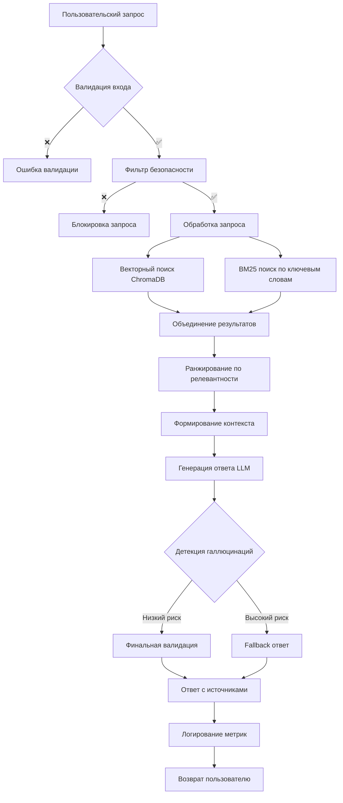

# 🏗️ Архитектура системы

## Обзор

AI Юридический Консультант построен на современной RAG (Retrieval-Augmented Generation) архитектуре с акцентом на безопасность, производительность и масштабируемость.

## 🔧 Компоненты системы

### 1. Уровень представления (Presentation Layer)

```
┌─────────────────────────────────────────┐
│           Presentation Layer            │
├─────────────────────────────────────────┤
│  Streamlit Web UI    │    CLI Interface │
│  - Интерактивный чат │    - Batch режим │
│  - Метрики в реальном│    - Автоматизация│
│    времени           │    - API calls    │
│  - Визуализация      │                  │
└─────────────────────────────────────────┘
```

#### Streamlit Web UI
- **Файл**: `app.py`
- **Функции**: Интерактивный чат, визуализация метрик, демонстрация возможностей
- **Технологии**: Streamlit, Plotly для графиков

#### CLI Interface  
- **Файл**: `main.py`
- **Функции**: Консольный доступ, автоматизация, интеграция в скрипты
- **Режимы**: Интерактивный и одиночные запросы

### 2. Уровень безопасности (Security Layer)

```
┌─────────────────────────────────────────┐
│            Security Layer               │
├─────────────────────────────────────────┤
│  Input Validation  │  Content Filter   │
│  - Санитизация    │  - HybridGuard    │ 
│  - Длина запроса  │  - Prompt Injection│
│  - Rate Limiting  │  - Content Moderation│
└─────────────────────────────────────────┘
```

#### Модули безопасности
- **src/security/filter.py**: Фильтрация вредоносного контента
- **src/security/validator.py**: Валидация входных данных
- **src/security/rate_limiter.py**: Ограничение частоты запросов

### 3. Уровень обработки (Processing Layer)

```
┌─────────────────────────────────────────┐
│           Processing Layer              │
├─────────────────────────────────────────┤
│      RAG Engine       │   Monitoring    │
│  ┌─────────────────┐  │  - Метрики      │
│  │ Query Processing│  │  - Логирование  │
│  │ Hybrid Retrieval│  │  - Трассировка  │
│  │ Response Gen.   │  │  - Аналитика    │
│  │ Halluc. Check   │  │                 │
│  └─────────────────┘  │                 │
└─────────────────────────────────────────┘
```

#### RAG Engine
- **src/core/rag_engine.py**: Основная логика RAG
- **src/core/retriever.py**: Гибридный поиск (Vector + BM25)
- **src/core/generator.py**: Генерация ответов через LLM
- **src/core/hallucination_detector.py**: Детекция галлюцинаций

### 4. Уровень данных (Data Layer)

```
┌─────────────────────────────────────────┐
│              Data Layer                 │
├─────────────────────────────────────────┤
│  ChromaDB        │  Knowledge Base     │
│  - Векторы       │  - Юридические      │
│  - Метаданные    │    документы        │
│  - Индексы       │  - Законы и нормы   │
│                  │  - Прецеденты       │
└─────────────────────────────────────────┘
```

#### Векторная база данных
- **ChromaDB**: Хранение и поиск эмбеддингов
- **src/data/vector_store.py**: Операции с векторной БД
- **src/data/loader.py**: Загрузка документов
- **src/data/processor.py**: Обработка и чанкинг текста

## 🔄 Поток обработки запроса



## 🧠 Детали RAG пайплайна

### 1. Векторный поиск
```python
# Процесс поиска схожих документов
query_embedding = embedding_model.encode(query)
similar_docs = chroma_db.similarity_search(
    query_embedding, 
    n_results=top_k
)
```

### 2. BM25 поиск
```python  
# Ключевой поиск по TF-IDF
bm25_scores = bm25.get_scores(tokenized_query)
top_bm25_docs = get_top_k_documents(bm25_scores)
```

### 3. Гибридное ранжирование
```python
# Комбинирование результатов двух подходов
final_score = α * vector_score + β * bm25_score
reranked_docs = sort_by_score(final_score)
```

### 4. Генерация ответа
```python
# Формирование промпта с контекстом
context = format_retrieved_documents(reranked_docs)
prompt = f"""
Контекст: {context}
Вопрос: {user_query}
Ответ:
"""
response = llm.generate(prompt)
```

## 🛡️ Система безопасности

### Многоуровневая защита

1. **Уровень входа**
   - Валидация длины запроса
   - Санитизация специальных символов  
   - Rate limiting по IP

2. **Уровень контента**
   - HybridGuard фильтрация
   - Детекция prompt injection
   - Модерация контента

3. **Уровень ответа**  
   - Проверка на галлюцинации
   - Валидация источников
   - Фильтрация неподобающего контента

### Детекция галлюцинаций

```python
def detect_hallucination(response, retrieved_docs):
    # 1. Проверка наличия фактов в источниках
    fact_coverage = check_fact_coverage(response, retrieved_docs)
    
    # 2. Семантическая близость к источникам
    semantic_similarity = compute_similarity(response, retrieved_docs)
    
    # 3. Консистентность с базой знаний
    consistency_score = check_consistency(response)
    
    # 4. Итоговая оценка
    hallucination_risk = combine_scores(
        fact_coverage, semantic_similarity, consistency_score
    )
    
    return hallucination_risk < threshold
```

## 📊 Мониторинг и аналитика

### Ключевые метрики

1. **Производительность**
   - Время ответа
   - Пропускная способность
   - Использование ресурсов

2. **Качество**
   - Оценка релевантности
   - Частота галлюцинаций
   - Покрытие источниками

3. **Безопасность**
   - Заблокированные запросы
   - Rate limiting события
   - Детекция атак

### Трассировка запросов

Опциональная интеграция с Phoenix для детальной трассировки:

```python
# Инструментация LangChain
from openinference.instrumentation.langchain import LangChainInstrumentor
LangChainInstrumentor().instrument()

# Все операции RAG автоматически трассируются
```

## 🚀 Масштабируемость

### Горизонтальное масштабирование
- Stateless архитектура
- Внешнее кэширование (Redis)
- Load balancing через Docker/K8s

### Оптимизация производительности
- Векторные индексы в ChromaDB
- Кэширование частых запросов
- Batch обработка эмбеддингов
- Connection pooling

## 🏁 Развертывание

### Docker контейнеризация
```dockerfile
# Многостадийная сборка для оптимизации размера
FROM python:3.11-slim as builder
# ... установка зависимостей

FROM python:3.11-slim as runtime  
# ... финальный образ
```

### Orchestration
- Docker Compose для разработки
- Kubernetes для продакшена
- Health checks и автоматический перезапуск

Эта архитектура обеспечивает высокую производительность, безопасность и готовность к промышленному использованию.